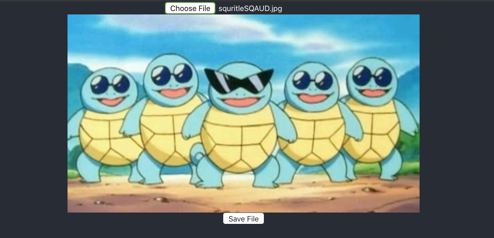
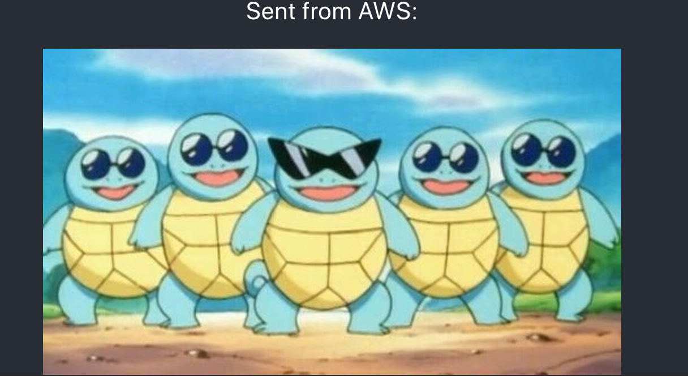

# Learning Amazon Web Services

## Description

Duration: 2 Days

What problem did you solve? How did you solve it?
Using what I know from working with the SERN stack, I was able to learn how to upload an image to AWS S3 storage as well as retrieve images from that storage within this application. I also used the AWS Amplify framework to help me handle the backend code of this application.

<!-- To see the fully functional site, please visit: DEPLOYED VERSION OF APP -->

## Wireframe
 
### Sending Photo to AWS S3 Bucket 

### Retrieving Photo from AWS S3 Bucket 

### Prerequisites

* https://nodejs.org/en/
* https://docs.aws.amazon.com/sdk-for-javascript/v2/developer-guide/s3-example-photo-album.html
* https://aws-amplify.github.io/docs/js/react

## Installation
This is a step by step list for how another developer could get this project up and running.

1. Set up an account on console.aws.amazon.com
2. Create react app
    * $ npx create-react-app myapp
    * $ cd myapp
    * npm install --save aws-amplify aws-amplify-react
3.  Install and configure the Amplify CLI
    * Note: The Amplify Command Line Interface (CLI) is a unified toolchain to create, integrate, and manage the AWS cloud services for your app
    * $ npm install -g @aws-amplify/cli
    * $ amplify configure
    * Create AWS profile locally
        * Specify the AWS Region: us-east-1
        * Specify the username of the new IAM user: aws-user
        * In the AWS Console (Browser), click Next: Permissions, Next: Review, & Create User to create the new IAM user. Then, return to the command line & press Enter.
        * Enter the access key of the newly created user:
        accessKeyId: (<YOUR_ACCESS_KEY_ID>)
        secretAccessKey: (<YOUR_SECRET_ACCESS_KEY>)
        * Profile Name: my-aws-app
5. To set up the backend, enter this in the terminal command line:
    * $ amplify init
        * Choose your default editor: Visual Studio Code (or your default editor)
        * Please choose the type of app that you're building: javascript
        * What javascript framework are you using: react
        * Source Directory Path: src
        * Distribution Directory Path: build
        * Build Command: npm run-script build
        * Start Command: npm run-script start
        * Do you want to use an AWS profile? Y
        * Please choose the profile you want to use: my-aws-app
    * Note: The Amplify CLI uses AWS CloudFormation, and you can add or modify configurations locally before you push them for execution in your account
    * How it Works: Rather than configuring each service through a constructor or constants file, Amplify supports configuration through a centralized file called amplifys which defines all the regions and service endpoints to communicate. Whenever you run amplify push, this file is automatically created allowing you to focus on your application code. The Amplify CLI will place this file in the appropriate source directory configured with amplify init.
    * To verify that we have CLI set up for our app we can run:
        * $ amplify status
6. To add a storage using amazon S3 type this into the command line in the terminal:
    * $ amplify add storage
        * Please select from one of the below mentioned services: Content (Images, audio, video, etc.)
        * Please provide a friendly name for your resource that will be used to label this category in the project: YOURAPINAME
        * Please provide bucket name: YOURUNIQUEBUCKETNAME
        * Who should have access: Auth users only
        * What kind of access do you want for Authenticated users read/write
7. Run command below in command line to create the service in your account
    * $ amplify push

## Usage
You can use this applicaiton to learn more about Amazon Web Services as well as be able to retrieve and store images without worrying too much about the backend. 

## Built With
* AWS Amplify
* AWS S3 Bucket
* JavaScript
* Express
* Node

## Acknowledgement
Thanks to Prime Digital Academy in Minneapolis who helped provide the foundation for me to be able to explore new technologies efficiently.

## Support
If you have suggestions or issues, please email me at harrisonnguyen517@gmail.com
